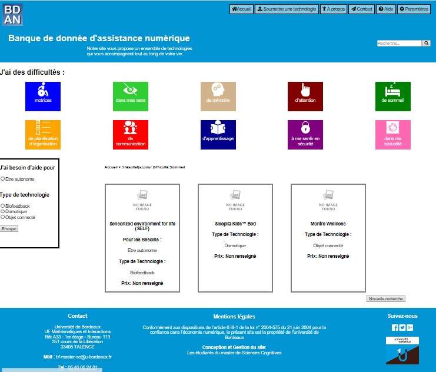

# webproject_final
This is a repository for a project of website dedicated to helping people with disabilities find suitable assistive technologies.

The website "Banque de donnée d'assistance numérique" (BDAN) is developed by students from the Cognitive Science Department at the University of Bordeaux, for the course of "multiple forme du métier".

It is written with Django. For more information about how to write a webapp with django, please go to https://www.djangoproject.com/start/.

## Functionalities of BDAN

* Allow users to filter databases by their difficulties, needs, and expected technology type.
* Allow users to search for assistant technologies by keywords.
* Allow users to upload information about assistive technologies. 
  It will be displayed on the page after being checked by the administrator.
  
## Database

At present, the database contains a total of 99 assistive technologies, 
which cover almost all types of disabilities such as sensory, motor and cognitive impairments.
